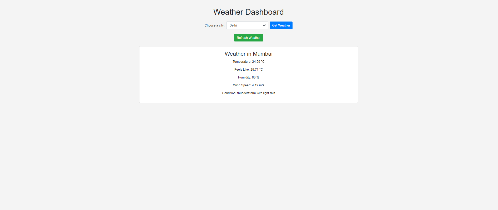

# Real-Time-Data-Processing-System-for-Weather

# Weather Alerting System 🌦️

## Table of Contents
- [Introduction](#introduction)
- [Objective](#objective)
- [Tech Stack](#tech-stack)
- [Project Folder Structure](#project-folder-structure)
- [Instructions to Use the Project](#instructions-to-use-the-project)
- [API Key Setup](#api-key-setup)
- [Features](#features)
- [Screenshots](#screenshots)
- [Conclusion](#conclusion)


## Introduction
The **Weather Alerting System** is a real-time weather monitoring application that retrieves data from the OpenWeatherMap API. It allows users to check weather updates for major Indian cities, set custom thresholds for temperature or other conditions, and receive alerts if thresholds are exceeded.


## Objective
The purpose of this project is to create an intuitive weather monitoring system that provides:
- Real-time weather updates for multiple cities.
- Custom alerting functionality based on user-defined thresholds.
- Daily summaries that offer insights on temperature and weather patterns.


## Tech Stack
- **Backend**: Python (Django framework)
- **Frontend**: HTML, CSS, JavaScript (jQuery)
- **Weather API**: OpenWeatherMap API
- **Database**: MYSQL database
- **Version Control**: Git & GitHub


## Project Folder Structure
```bash
weather-alerting-system/
├── weather/
│   ├── migrations/
│   ├── static/
│   │   ├── weather/
│   │   │   ├── style.css         # CSS for styling the frontend
│   │   │   └── weather.js        # JavaScript for dynamic content and threshold alerts
│   ├── templates/
│   │   ├── weather/
│   │   │   ├── index.html        # HTML template for the main weather dashboard
│   ├── __init__.py
│   ├── models.py                 # Django models for storing weather data and thresholds
│   ├── views.py                  # Backend logic to fetch weather and handle alerts
│   └── urls.py                   # URL routing for different pages
├── manage.py                     # Django project management script
├── db.sqlite3                    # SQLite database storing user settings and weather info
├── requirements.txt              # Python packages required for the project
└── README.md                     # Documentation of the project
```


## Installation

1. **Clone the repository:**
   ```bash
   git clone https://github.com/yourusername/WeatherDashboard.git
   cd WeatherDashboard
   
**Create a virtual environment (optional but recommended):**

```bash
python -m venv venv
source venv/bin/activate  # On Windows use `venv\Scripts\activate`
```

**Install the required packages:**

```bash
pip install -r requirements.txt
```

**Set up your Django database:**

```bash
python manage.py migrate
```

**Create a superuser (optional):**

```bash
python manage.py createsuperuser
```

**Run the development server:**

```bash
python manage.py runserver
```

**Open your web browser and go to:**

Enter the name of the city and submit to see the weather data.

```bash
http://127.0.0.1:8000/weather/   
```


## API Key Setup

1. **Obtain your API key from OpenWeather:**
   - Sign up at [OpenWeather](https://openweathermap.org/api) and create an API key.

2. **Add your API key to the Django project:**
   - Open the `views.py` file in your Django application.
   - Locate the following line and replace `'YOUR_API_KEY'` with your actual API key:
     ```python
     api_key = '313df2b03ff34dc2d274ceed8a9fb676'  # Replace with your actual API key
     ```

4. **Test Your Setup:**
   - Restart your Django server and test the application to ensure the API key is working correctly.


## Features
- **Real-time Weather Data**: The system retrieves real-time weather data from the OpenWeatherMap API, providing users with temperature, humidity, wind speed, and other weather conditions for selected cities.
- **City Selection**: Users can choose from a list of major Indian cities to view the current weather without needing to type the city name manually.
- **Custom Threshold Alerts**: Users can set custom thresholds for temperature, wind speed, humidity, and other parameters. The system triggers an alert when the weather data exceeds or violates the user-defined thresholds.
- **Weather Summary**: The system calculates and displays daily weather summaries including average, maximum, and minimum temperatures, as well as the dominant weather condition for the day.
- **Temperature Conversion**: Supports conversion of temperature from Kelvin to Celsius (or Fahrenheit) based on user preference.
- **Responsive Design**: The user interface is responsive and works across devices of different screen sizes, providing a smooth experience.


## Screenshots
### 1. Weather Dashboard



## Conclusion

The Weather Dashboard is a user-friendly web application designed to provide real-time weather information for various cities. By leveraging the OpenWeather API, users can effortlessly fetch current weather data and daily summaries for their selected locations. 

### Future Enhancements
Future iterations of the project could include features such as:
- **User Authentication:** Allow users to save their favorite cities.
- **Weather Forecasting:** Provide extended forecasts beyond the current day.
- **Visualizations:** Integrate charts and graphs to display weather trends over time.

Thank you for using the Weather Dashboard! We hope you find it helpful in planning your daily activities based on the weather.


